```{r include=FALSE}
library(knitr)
```


# {#intro-slide data-background="assets/img/background.jpg"}

## {#intro-slide data-background="assets/img/background.jpg"}

<div id="intro-text-box">Coral reefs are one of the most diverse ecosystem on the planet.</div><br>
<div id="intro-text-box" class="fragment fade-left">They are economically vital for many people worldwide</div><br>
<div id="intro-text-box" class="fragment fade-left">They face great challenges and their population is rapidely declining.</div>

# The coral microbiome {#coral data-transition="zoom-out"}


# {data-transition="zoom-in"}


# Technologies to study the microbiome

## Sequencing

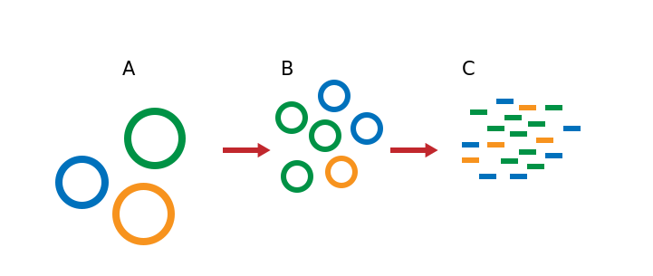

## Bioinformatics

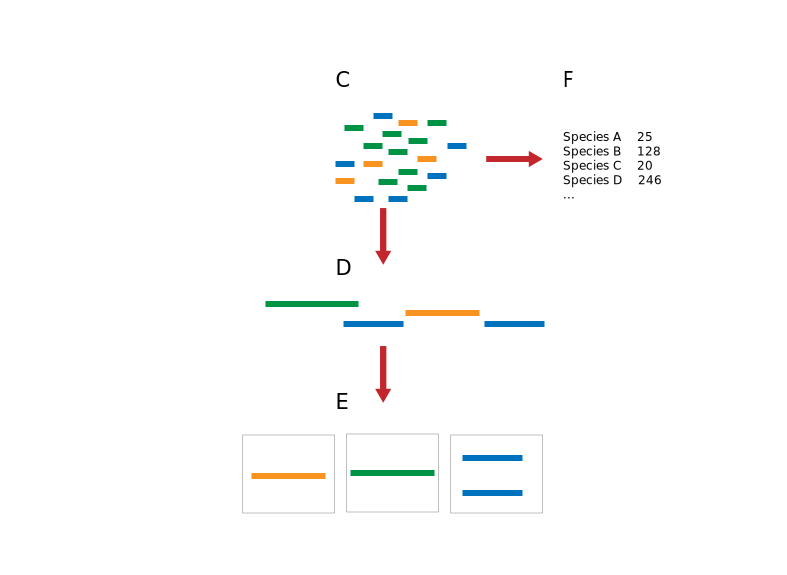

# Why study the coral microbiome?

## {data-background="assets/img/why_bg.svg"}

# Aims

- Improve methodology within the field of metagenomics
- Understanding coral-associated microbes better

# Simulating Illumina Metagenomic Data with InSilicoSeq {#paper data-background="assets/img/paper_i.svg"}

## Why? {#paper data-background="assets/img/paper_i.svg"}

<div class="fragment fade-in">
why do we need simulated data?
</div>

## {#paper data-background="assets/img/paper_i.svg"}

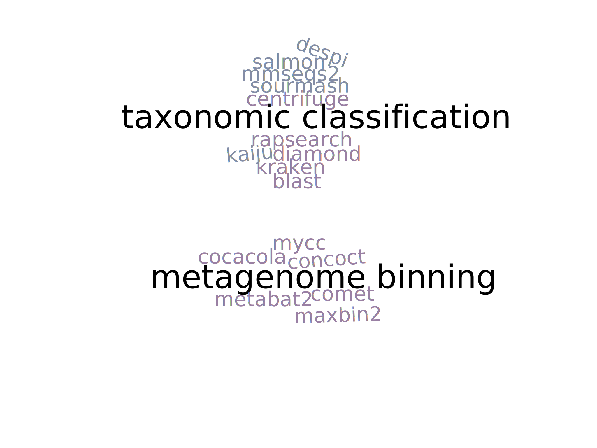

## Why? {#paper data-background="assets/img/paper_i.svg"}

why do we need simulated data?
<div class="fragment fade-in">
why do we need *yet another* simulation software?
</div>

## Results {#paper data-background="assets/img/paper_i.svg"}

Easily installable and usable

```bash
$ conda install insilicoseq
$ iss generate --ncbi bacteria -U 100 -n 10M \
    --model novaseq --cpus 8 --output reads
```

And used in the development of 10 new published metagenomic software.

## Results {#paper data-background="assets/img/paper_i.svg"}

Kernel Density Estimation

:::::: {style="display: flex;"}
::: {.column width="50%"}
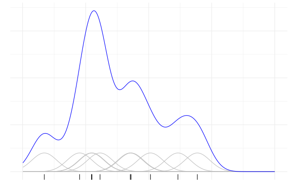
:::
::: {.column width="50%"}
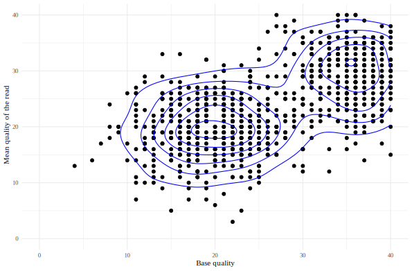
:::
::::::

## Results {#paper data-background="assets/img/paper_i.svg"}

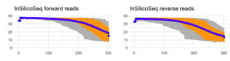

## {#paper data-background="assets/img/paper_i.svg"}


# Paper II - A Data Driven Review of the Coral Microbiome {#paper data-background="assets/img/paper_ii.svg"}

## The 16S gene and metabarcoding {#paper data-background="assets/img/paper_ii.svg"}


## Methods {#paper data-background="assets/img/paper_ii.svg"}

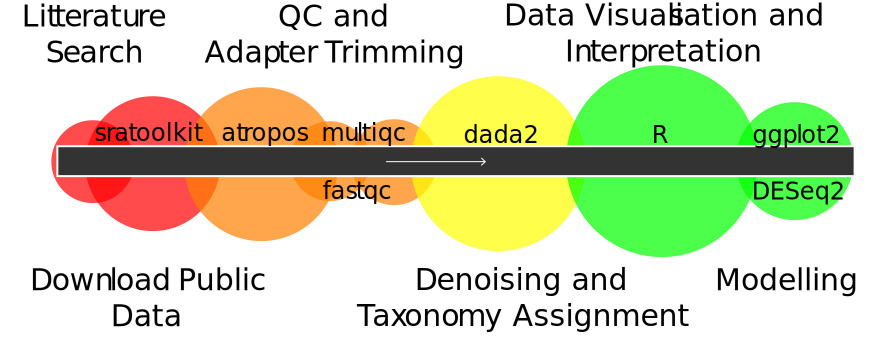

## Methods {#paper data-background="assets/img/paper_ii.svg"}

- dada2 handles fine-scale variations
- less impact from contaminants

## Methods {#paper data-background="assets/img/paper_ii.svg"}

- shrinkage
- GLM for each gene
- Wald test

## Results {#paper data-background="assets/img/paper_ii.svg"}

:::::: {style="display: flex;"}
::: {.column width="40%" height="400px"}
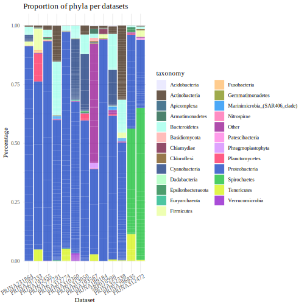
:::
::: {.column width="60%" height="400px"}
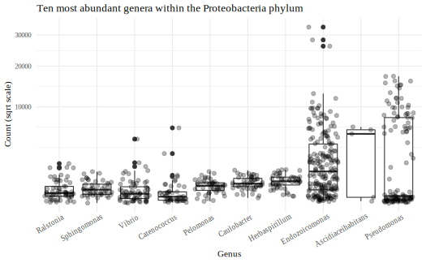
:::
::::::

## Results {#paper data-background="assets/img/paper_ii.svg"}

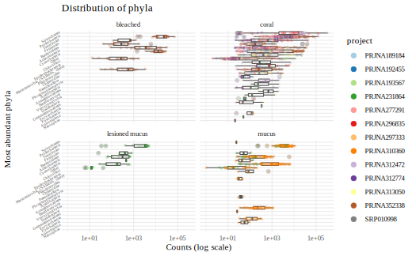

# Molecular Ecology of Coral Reef Microorganisms in the Western Indian Ocean coast of Kenya {#paper3 data-background="assets/img/paper_iii.svg"}

## {#paper3 data-background="assets/img/why_bg.svg"}

## Methods {#paper3 .workflow data-background="assets/img/paper_iii.svg"}

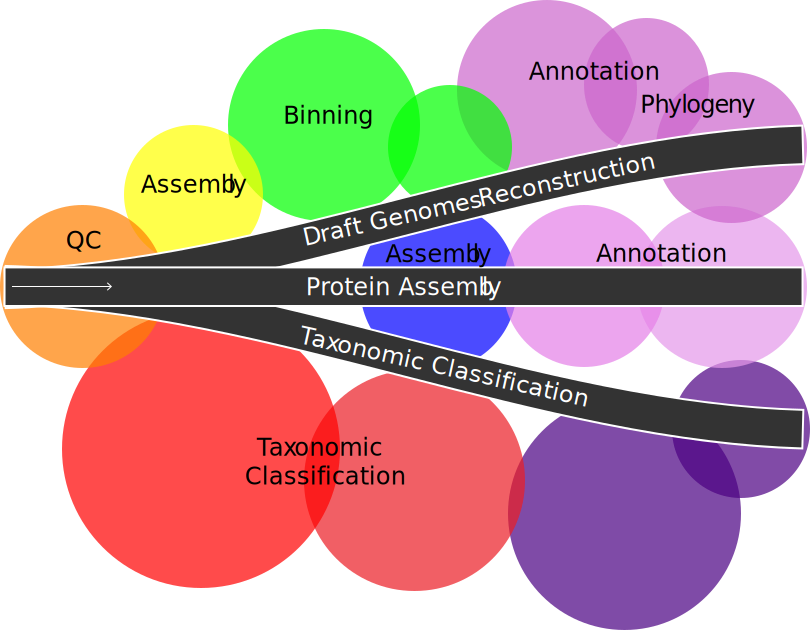

## Results {#paper3 .bar data-background="assets/img/paper_iii.svg"}

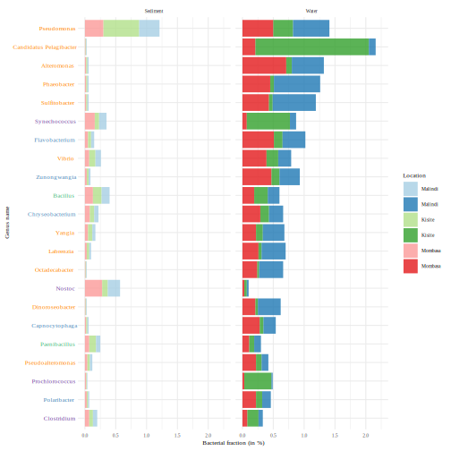

## Results {#paper3 .tree data-background="assets/img/paper_iii.svg"}

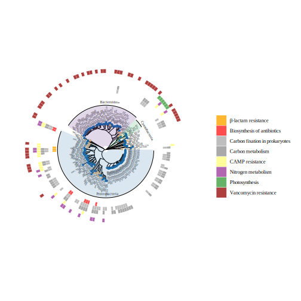

## Results  {#paper3 data-background="assets/img/paper_iii.svg"}

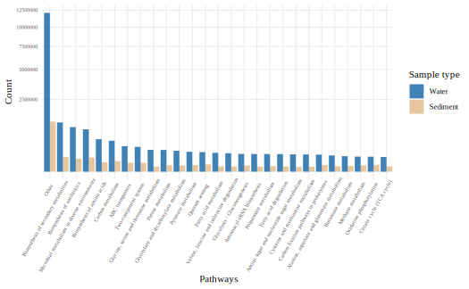

# Conclusion

- warm water coral microbiomes is dominated by Endozoicomonas, but we are unsare what its role is
- metagenomics allows insight into function, allowing to dive in the microbiome
- coral bacteria are sensitive to pollution, and are good potential markers for monitoring reef health and eventually inform policy making

# Future perspectives

## Methods

- need for benchmarking is still there
- automatic metagenome binning methods have a lot of room for improvement

## Corals

- Whole metagenome sequencing on coral samples (SML)
- This project is ongoing, sampling and sequencing done!

# {#thanks data-background="assets/img/thank_you.svg"}
