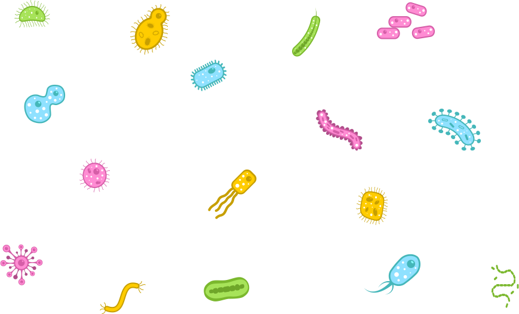

# {#intro-slide data-background="assets/img/background.jpg"}

## {#intro-slide data-background="assets/img/background.jpg"}

<div id="intro-text-box">Coral reefs are one of the most diverse ecosystem on the planet.</div><br>
<div id="intro-text-box" class="fragment fade-left">They are economically vital for many people worldwide</div><br>
<div id="intro-text-box" class="fragment fade-left">They face great challenges and their population is rapidely declining.</div>

# The coral microbiome {#coral data-transition="zoom-out"}


# {data-transition="zoom-in"}



# Technologies to study the microbiome

_TODO_

# Aims

- metagenomics, improve methodology
- more understanding of coral microbiome, for helping them

# Simulating Illumina Metagenomic Data with InSilicoSeq {#paper data-background="assets/img/paper_i.svg"}

## Why? {#paper data-background="assets/img/paper_i.svg"}

- metagenomics is kinda new
- previous simulator did not meet our needs
- testing and benchmarking software

## Results {#paper data-background="assets/img/paper_i.svg"}

```bash
$ pip install insilicoseq
$ iss generate --ncbi bacteria -U 100 -n 10M \
    --model novaseq --cpus 8 --output reads
```

## Kernel Density Estimation

hisograms vs KDE

## Benchmarking {#paper data-background="assets/img/paper_i.svg"}

- LOTS of taxonomy classifications tools
- a few different binning software

# Paper II - Data review

## The 16S gene and metabarcoding
## "Special" review of the field
## Results
## The way forward

# Paper III

## Why?
## Results
## Future Perspectives

# Future future perspectives

## Methods
## Mucus
